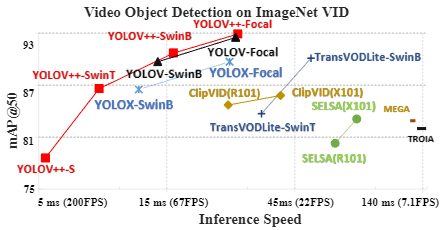
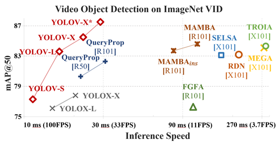

# YOLOV and YOLOV++ for video object detection.
## Update
* **` July. 30th, 2024`**:  The pre-print version of the YOLOV++ paper is now available on [Arxiv](https://arxiv.org/abs/2407.19650).

* **` April. 21th, 2024`**:  Our enhanced model now achieves a 92.9 AP50(w.o post-processing) on the ImageNet VID dataset, thanks to a more robust backbone and algorithm improvements. It maintains a processing time of 26.5ms per image during batch inference on a 3090 GPU. Code release is forthcoming.

* **` May. 8th, 2024`**:  We release code, log and weights for YOLOV++.

## Introduction
[](https://paperswithcode.com/sota/video-object-detection-on-imagenet-vid?p=practical-video-object-detection-via-feature)
[](https://paperswithcode.com/sota/video-object-detection-on-imagenet-vid?p=yolov-making-still-image-object-detectors)

YOLOV series are high performance video object detector.  Please refer to [YOLOV](https://arxiv.org/abs/2208.09686) and [YOLOV++](https://arxiv.org/abs/2407.19650) on Arxiv for more details.

This repo is an implementation of PyTorch version YOLOV and YOLOV++ based on [YOLOX](https://github.com/Megvii-BaseDetection/YOLOX).

## YOLOX Pretain Models on ImageNet VID

| Model            | size | mAP@50<sup>val<br> | Speed 2080Ti(batch size=1)<br>(ms) | Speed 3090(batch size=32)<br>(ms) |                                             weights                                              |
|------------------|:----:|:------------------:|:----------------------------------:|:---------------------------------:|:------------------------------------------------------------------------------------------------:|
| YOLOX-s          | 576  |        69.5        |                9.4                 |                1.4                |   [google](https://drive.google.com/file/d/1n8wkByqpHdrGy6z9fsoZpBtTa0I3JOcG/view?usp=sharing)   |
| YOLOX-l          | 576  |        76.1        |                14.8                |                4.2                |   [google](https://drive.google.com/file/d/1rikaPCAHBBIugYUZYV1buyOIRG8xvGKB/view?usp=sharing)   |
| YOLOX-x          | 576  |        77.8        |                20.4                |                 -                 |   [google](https://drive.google.com/file/d/1OH3hGj7RMfcinMKPESbfI7C5y_RrA3aF/view?usp=sharing)   |
| YOLOX-SwinTiny   | 576  |        79.2        |                19.0                |                5.5                |[google](https://drive.google.com/file/d/1s1gKLXMX5Hwxkx7e9nZyzJ1oF9iPvEe1/view?usp=drive_link)   |
| YOLOX-SwinBase   | 576  |        86.5        |                24.9                |               11.8                |[google](https://drive.google.com/drive/folders/1K5897iM2zzN4kcj8qdK3z_FtvW9f3kHN?usp=drive_link) |
| YOLOX-FocalLarge | 576  |        89.7        |                42.2                |               25.7                |                                                -                                                 |


## Main result in YOLOV++



| Model                     | size | mAP@50<sup>val<br> | Speed 3090(batch size=32)<br>(ms) |                                                                                                                                weights                                                                                                                                 | logs                                                                                          |
|---------------------------|:----:|:------------------:|:---------------------------------:|:----------------------------------------------------------------------------------------------------------------------------------------------------------------------------------------------------------------------------------------------------------------------:|-----------------------------------------------------------------------------------------------|
| YOLOV++ s                 | 576  |        78.7        |                5.3                |                                                                                    [google](https://drive.google.com/file/d/1vlFlwyoRoo_qS2CkfTZE5iQ32MDoA1n4/view?usp=drive_link)                                                                                     | [link](https://drive.google.com/file/d/1wIA71zsNxAtDflPGxLTzrRDdKy0Zl1HZ/view?usp=drive_link) |
| YOLOV++ l                 | 576  |        84.2        |                7.6                |                                                                                    [google](https://drive.google.com/file/d/1qb_abseRfOmRr8IiOuUSAlCUrBvUhdim/view?usp=drive_link)                                                                                     | -                                                                                             |
| YOLOV++ SwinTiny          | 576  |        85.6        |                8.4                |                                                                                    [google](https://drive.google.com/file/d/1pCIWAK6cy-BHhDVywmPb1LuuQHzNXdT2/view?usp=drive_link)                                                                                     | [link](https://drive.google.com/file/d/1RmY0LW1sUil6WilvNq2hW1a4obw27531/view?usp=drive_link)                                                                                      |
| YOLOV++ SwinBase          | 576  |        90.7        |               15.9                |                                                                                    [google](https://drive.google.com/file/d/1RGb499EBcSQjWDxu6KkvN4Tr1wSc6SHb/view?usp=drive_link)                                                                                     | [link](https://drive.google.com/file/d/10qGMScfy0BvmqSMLuTGRPRlZxqkNZ9GX/view?usp=drive_link)                                                                                      |
| YOLOV++ FocalLarge        | 576  |        92.9        |               27.6                |                                                                                    [google](https://drive.google.com/file/d/11WT_GcZU7HHjWV4i9KoXHhh70zneraEE/view?usp=drive_link)                                                                                     | [link](https://huggingface.co/YuhengSSS/YOLOV/blob/main/V%2B%2B_FocalL.pth)                                                                                      |
| YOLOV++ FocalLarge + Post | 576  |        93.2        |                 -                 |                                                                                                                                   -                                                                                                                                    |                                                                                      |


## Main result in YOLOV



| Model                                                                                                               | size | mAP@50<sup>val<br> | Speed 2080Ti(batch size=1)<br>(ms) |                                           weights                                            |
|---------------------------------------------------------------------------------------------------------------------|:----:|:------------------:|:----------------------------------:|:--------------------------------------------------------------------------------------------:|
| YOLOV-s                                                                                                             | 576  |        77.3        |                11.3                | [google](https://drive.google.com/file/d/12X4dQw45aXVYgJjKAAAPk409FO3xValW/view?usp=sharing) |
| YOLOV-l                                                                                                             | 576  |        83.6        |                16.4                | [google](https://drive.google.com/file/d/1qZ-3iPDlYx1OKe6zz_-n42ceijo_Ntx6/view?usp=sharing) |
| YOLOV-x                                                                                                             | 576  |        85.5        |                22.7                | [google](https://drive.google.com/file/d/1OIozS-D9wbWA9pDFl5xoFw6XqEcYtzsJ/view?usp=sharing) |
| YOLOV-x + [post](https://github.com/AlbertoSabater/Robust-and-efficient-post-processing-for-video-object-detection) | 576  |        87.5        |                 -                  |                                              -                                               |


## TODO
- [x] Finish Swin-Transformer based experiments.
- [ ] Release updated code, model and log.

## Quick Start

<details>
<summary>Installation</summary>

Install YOLOV from source.
```shell
git clone git@github.com:YuHengsss/YOLOV.git
cd YOLOV
```

Create conda env.
```shell
conda create -n yolov python=3.7

conda activate yolov

pip install -r requirements.txt

pip3 install -v -e .
```
</details>

<details>
<summary>Demo</summary>

Step1. Download a pretrained weights.

Step2. Run yolov demos. For example:

```shell
python tools/vid_demo.py -f [path to your yolov exp files] -c [path to your yolov weights] --path /path/to/your/video --conf 0.25 --nms 0.5 --tsize 576 --save_result 
```
For online mode, exampled with yolov_l, you can run:

```shell
python tools/yolov_demo_online.py -f ./exp/yolov/yolov_l_online.py -c [path to your weights] --path /path/to/your/video --conf 0.25 --nms 0.5 --tsize 576 --save_result 
```
For yolox models, please use python tools/demo.py for inferencing.
</details>

<details>
<summary>Reproduce our results on VID</summary>

Step1. Download datasets and weights:

Download ILSVRC2015 DET and ILSVRC2015 VID dataset from [IMAGENET](https://image-net.org/challenges/LSVRC/2015/2015-downloads) and organise them as follows:

```shell
path to your datasets/ILSVRC2015/
path to your datasets/ILSVRC/
```

Download our COCO-style annotations for [training](https://drive.google.com/file/d/1HhE4OAcc--CpjUj69JCRXzMvIRsR4ymM/view?usp=sharing), FGFA version training [annotation](https://drive.google.com/file/d/12ceMTsmwkCMCdjYSM268qYfQTQcCDYFU/view?usp=drive_link) and [video sequences](https://drive.google.com/file/d/1vJs8rLl_2oZOWCMJtk3a9ZJmdNn8cu-G/view?usp=sharing). Then, put them in these two directories:
```shell
YOLOV/annotations/vid_train_coco.json
YOLOV/annotations/ILSVRC_FGFA_COCO.json
YOLOV/yolox/data/dataset/train_seq.npy
```

Change the data_dir in exp files to [path to your datasets] and Download our weights.

Step2. Generate predictions and convert them to IMDB style for evaluation.

```shell
python tools/val_to_imdb.py -f exps/yolov/yolov_x.py -c path to your weights/yolov_x.pth --fp16 --output_dir ./yolov_x.pkl
```
Evaluation process:
```shell
python tools/REPPM.py --repp_cfg ./tools/yolo_repp_cfg.json --predictions_file ./yolov_x.pkl --evaluate --annotations_filename ./annotations/annotations_val_ILSVRC.txt --path_dataset [path to your dataset] --store_imdb --store_coco  (--post)
```
(--post) indicates involving post-processing method. Then you will get:
```shell
{'mAP_total': 0.8758871720817065, 'mAP_slow': 0.9059275666099181, 'mAP_medium': 0.8691557352372217, 'mAP_fast': 0.7459511040452989}
```

  
**Training example**
```shell
python tools/vid_train.py -f exps/yolov/yolov_s.py -c weights/yoloxs_vid.pth --fp16
```
**Roughly testing**
```shell
python tools/vid_eval.py -f exps/yolov/yolov_s.py -c weights/yolov_s.pth --tnum 500 --fp16
```
tnum indicates testing sequence number.
</details>


## Annotation format

<details>
  
<summary> <b>Details</b> </summary>

**Training base detector**


The train_coco.json is a COCO format annotation file. When trainig the base detector on your own dataset, try to convert the annotation to COCO format.

**Training YOLOV Series**


The train_seq.npy and val_seq.npy files are numpy arrays of lists. They can be loaded using the following command:
```shell
numpy.load('./yolox/data/datasets/train_seq.npy',allow_pickle=True)
```
Each list contains the paths to all images in a video. The specific annotations(xml annotation in VID dataset) are loaded via these image paths, refer to https://github.com/YuHengsss/YOLOV/blob/f5a57ddea2f3660875d6d75fc5fa2ddbb95028a7/yolox/data/datasets/vid.py#L125 for more details.

</details>


## Training on Custom Datasets

<details>
<summary> <b>Details</b> </summary>
  
1. Finetuing the base detector(YOLOX) on your custom dataset with COCO format annotation. You need to modify the YOLOX experiment file. For instance, the experiment file for the Imagenet VID dataset is modified as [this example](https://github.com/YuHengsss/YOLOV/blob/master/exps/swin_base/swin_tiny_vid.py). Initialized weights with COCO pretraining is essential for the performance, you can find these coco pretrained weights in YOLOX official repo (YOLOX-S~YOLOX-X) and this [huggingface repo](https://huggingface.co/YuhengSSS/YOLOV/tree/main) (YOLOX-SwinTiny and SwinBase).


2. Construct your dataset in the COCO format. Here is a template for the dataset structure (sourced from [OVIS](https://songbai.site/ovis/)):
    ```shell
    {
    "info" : info,
    "videos" : [video],
    "annotations" : [annotation] or None,
    "categories" : [category],
    }
    video{
        "id" : int,
        "width" : int,
        "height" : int,
        "length" : int,
        "file_names" : [file_name],
    }
    annotation{
        "id" : int, 
        "video_id" : int, 
        "category_id" : int, 
        "areas" : [float or None], 
        "bboxes" : [[x,y,width,height] or None], 
        "iscrowd" : 0 or 1,
    }
    category{
        "id" : int, 
        "name" : str, 
        "supercategory" : str,
    }
    ```

    After preparing the COCO format dataset, we provide [code](https://github.com/YuHengsss/YOLOV/blob/8873e06cac9912c60c31ca2ef3061d0bfe5b2f36/yolox/data/datasets/ovis.py#L238) which converts the COCO format annotation for video object detection. You can construct your experiment file of YOLOV such as [YOLOVs_OVIS](https://github.com/YuHengsss/YOLOV/blob/master/exps/yolov_ovis/yolovs_ovis_75_75_750.py). For YOLOV++, you can combine the this [dataloader](https://github.com/YuHengsss/YOLOV/blob/8873e06cac9912c60c31ca2ef3061d0bfe5b2f36/exps/yolov_ovis/yolovs_ovis_75_75_750.py#L121) with the default [experiment file](https://github.com/YuHengsss/YOLOV/blob/master/exps/yolov%2B%2B/v%2B%2B_SwinTiny_decoupleReg.py) for training on the custom dataset.  

3. Initialize the YOLOV or YOLOV++ with finetuned weights obtained by Step 1. Note that you may adjust the hyperparameters such as [proposal numbers](https://github.com/YuHengsss/YOLOV/blob/8873e06cac9912c60c31ca2ef3061d0bfe5b2f36/exps/yolov_ovis/yolovs_ovis_75_75_750.py#L56) according to your dataset for getting better performance.

</details>

## Acknowledgements

<details><summary> <b>Expand</b> </summary>

* [https://github.com/Megvii-BaseDetection/YOLOX](https://github.com/Megvii-BaseDetection/YOLOX)
* [https://github.com/AlbertoSabater/Robust-and-efficient-post-processing-for-video-object-detection](https://github.com/AlbertoSabater/Robust-and-efficient-post-processing-for-video-object-detection)
</details>

## Cite YOLOV and YOLOV++
If YOLOV series are helpful for your research, please cite the following paper:


```latex

@article{shi2024yolovpp,
      title={Practical Video Object Detection via Feature Selection and Aggregation}, 
      author={Yuheng Shi and Tong Zhang and Xiaojie Guo},
      journal={arXiv preprint arXiv:2407.19650},
      year={2024},
}

@article{shi2022yolov,
  title={YOLOV: Making Still Image Object Detectors Great at Video Object Detection},
  author={Shi, Yuheng and Wang, Naiyan and Guo, Xiaojie},
  journal={arXiv preprint arXiv:2208.09686},
  year={2022}
}
```
